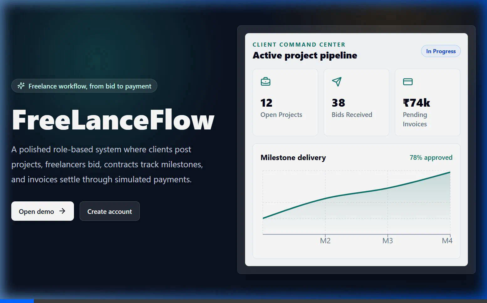
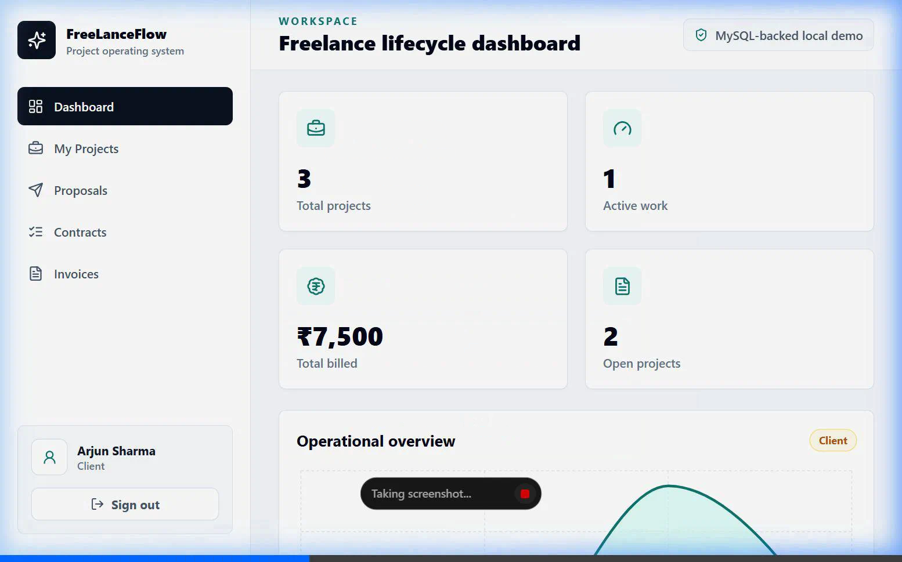
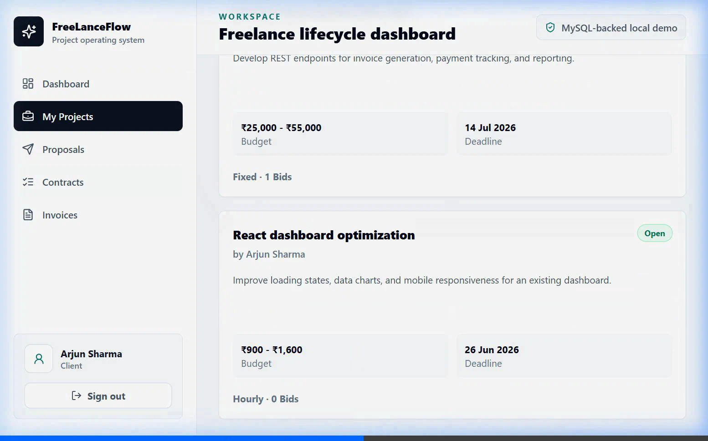
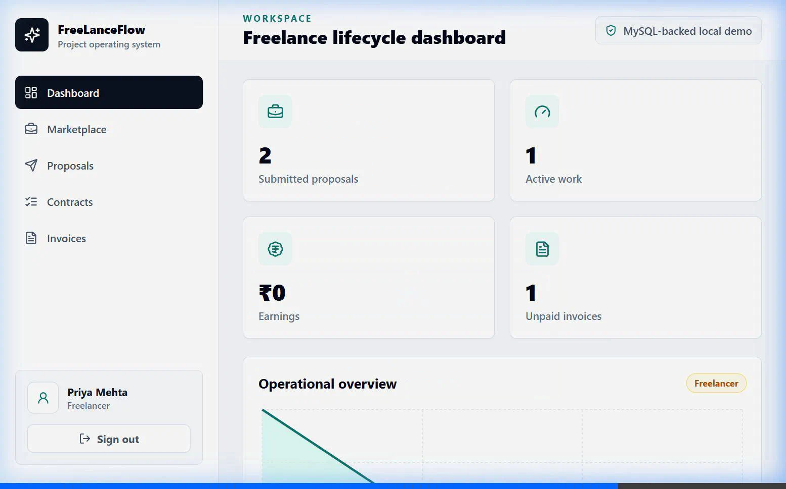
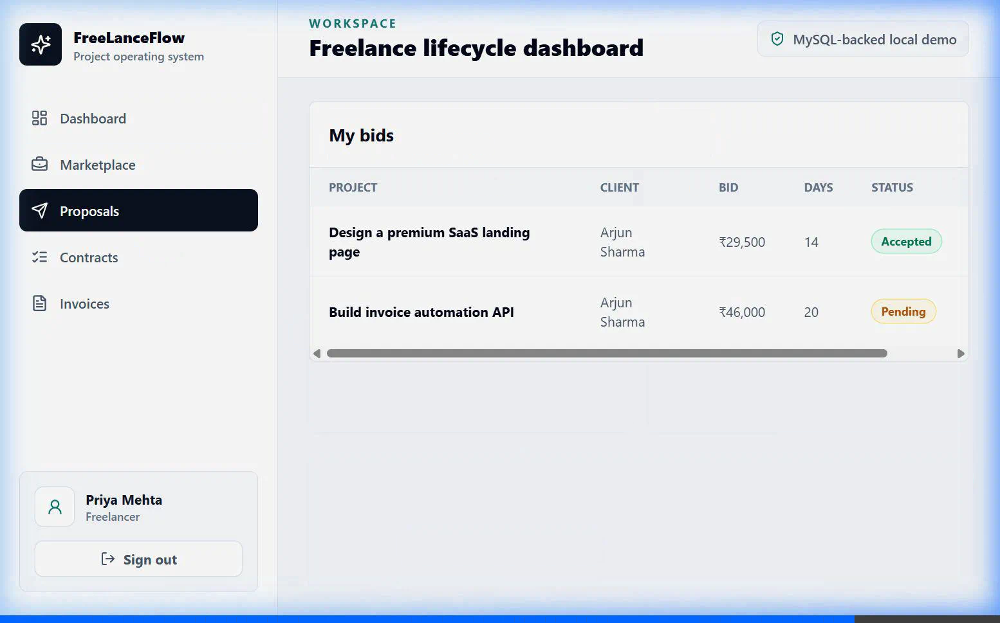

# FreeLanceFlow

FreeLanceFlow is a modern, full-stack freelancer project management system. It provides a seamless collaborative platform for clients and freelancers to manage project lifecycles, contract milestones, invoices, and payments.

## 🚀 Key Features

*   **Role-Based Dashboards**: Tailored workspaces and analytics for Clients, Freelancers, and Admins.
*   **Project Lifecycle Management**: Post projects, browse listings, submit detailed bids/proposals, and accept bids to automatically generate active contracts.
*   **Milestone & Progress Tracking**: Clients can define milestones, freelancers can submit progress updates, and clients can approve completed milestones.
*   **Automated Invoicing & Payments**: Automatic invoice generation upon milestone approvals, and support for simulated payments (UPI, Card, Bank, Wallet).
*   **JWT Authentication**: Secure user authentication with JSON Web Tokens and hashed passwords.
*   **MySQL Database Backend**: Robust relational database schema with referential integrity, stored procedures, and triggers for transaction handling.

---

## 📸 User Interface Screenshots

### 🔑 Secure Login Screen


### 💼 Client Workspace & Dashboard


### 🛠️ Freelancer Workspace & Earnings Tracker


### 📜 Contracts & Milestones Management


### 💳 Invoices & Payment Gateway


---

## 🛠️ Technology Stack

*   **Frontend**: React, TypeScript, Vite, Tailwind CSS, React Router, Framer Motion, Recharts, Lucide Icons
*   **Backend**: Node.js, Express, TypeScript, JWT, bcryptjs
*   **Database**: MySQL (using `mysql2` driver)

---

## ⚙️ Local Setup Instructions

### 1. Prerequisites
Ensure you have the following installed:
*   [Node.js](https://nodejs.org/) (v18+)
*   [MySQL Server](https://www.mysql.com/)

### 2. Install Dependencies
Run the following command at the root of the project to install all monorepo dependencies for both client and server:
```bash
npm install
```

### 3. Database Initialization
Start your MySQL server, connect to it, and execute the SQL scripts to create the database schema and populate sample data:
```sql
SOURCE database/schema.sql;
SOURCE database/seed.sql;
```

### 4. Backend Configuration
Create a `.env` file in the `server` directory:
```bash
copy server\.env.example server\.env
```
Update `server/.env` with your MySQL connection details:
```env
PORT=4000
CLIENT_ORIGIN=http://localhost:5173
JWT_SECRET=change-this-local-demo-secret
DB_HOST=localhost
DB_PORT=3306
DB_USER=root
DB_PASSWORD=your_mysql_password
DB_NAME=freelanceflow
```

### 5. Run the Application
Start the development server for both frontend and backend concurrently:
```bash
npm run dev
```
Once started, you can access the application at:
*   **Frontend**: [http://localhost:5173](http://localhost:5173)
*   **Backend API**: [http://localhost:4000](http://localhost:4000)

---

## 👥 Demo Accounts

Use the following credentials to explore the different workspaces:

| Role | Email | Password |
| :--- | :--- | :--- |
| **Client** | `arjun@email.com` | `password123` |
| **Freelancer** | `priya@email.com` | `password123` |
| **Admin** | `admin@freelanceflow.local` | `password123` |
